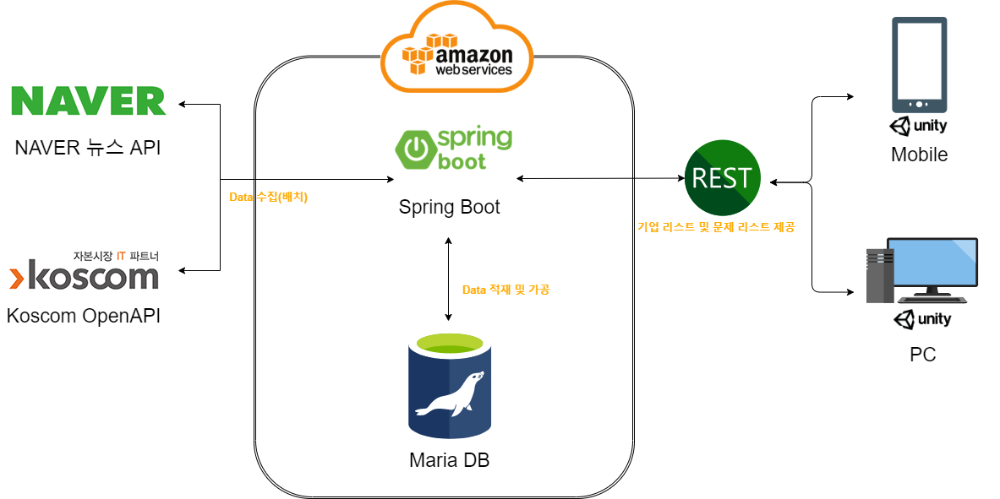

# StockOX

Koscom 2020 신입사원 해커톤에서 발표할, StockOX 프로젝트를 위한 Repo입니다.

## 실행 환경
### Back-end
```
AWS Ubuntu 20.04.1 LTS
openjdk 1.8
```

## 실행 방법
```
git clone https://github.com/csh1man/stockOX.git
```
### Front-end 
```
../front-end/target/StockOX.exe 
```

### Back-end
```
cd Backend
chmod +x gradlew
./gradlew build
cd build/libs
java -jar stockox-0.0.1-SNAPSHOT.jar
```

### 배치파일 실행(crontab으로 매일 저녁 10시 수행)
```
cd /home/ubuntu/batch
./batch.sh
```

## 목적 및 기대 효과
* 목적
  * Koscom OpenAPI와 기타 외부 데이터를 이용하여 만든 간편 게임 서비스를 통한,  
  주식 입문자의 증권시장 배경지식과 주가 정보 습득
    * Gamification 개념 적용(게임을 통한 접근성 확보)


* 배경
  * 코로나-19로 인한 금리 인하로 유동성 공급에 따른 주식 입문자 증가
    * 2019년 (260만 개) 比 2020년 (723만 개) 신규 증권계좌 수 300% 증가
  * 신규 증권계좌 수 중 2030세대 비율이 과반수
    * 2020년 신규 증권계좌 수 중 2030세대 비율 54%(392만 개) 차지
  * 신규 진입자의 대다수가 증권시장 기본지식과 금융이해력 부족


* 기대 효과
  * 다양한 주식 입문자의 주식시장 기초지식 함양을 통한  
  건전한 투자의식 확립과 심화 지식 습득을 위한 발판 마련


## 시스템 아키텍처




## 기술 스택

* Spring Boot : 서버
* Maria DB : 기업 정보 및 주요 뉴스, Daily 주가 정보 등 데이터 적재
* AWS(Amazone Web Services) : Back-End 프로덕트 구동
* Unity Engine : 게임 구현
* Travis CI : 빌드 및 테스트 자동화


* APIs
  * Koscom Open API
  * Naver 뉴스 검색 API


## 개발 및 기여자

* 우민우
* 최서현
* 김영우
* 김영인
